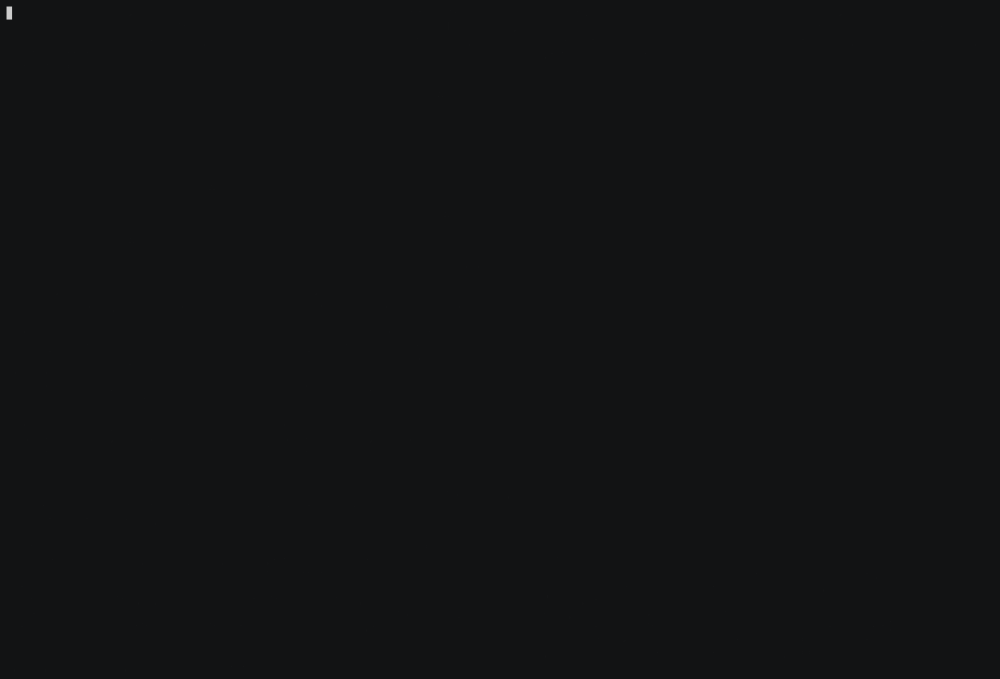

# LLM vs LLM Tower Defense

A terminal tower defense game written in Go where any two configured LLMs compete in real time — and, more to the point, a small arena for measuring how they play.



A real match, not a scripted one: `gemini-2.5-flash-lite` on both sides, seed 7, recorded 2026-08-07. Every applied action came from a model — the run reports `authored_def=100% | authored_att=100%` with zero provider errors and zero rejected actions — and **engine assists are off**, so all four waves were launched by the attacker rather than corrected into existence by the engine. The attacker wins on wave 4: the defender opens with two basic towers and a control research level, and the attacker converts income straight into wave pressure faster than the defense can absorb it.

The caption has been earned twice over. An earlier re-recording was 100% model-authored and still not honest: it ran at the interactive default, with assists on, and **four of its five waves were `applied_auto_wave`** — the model's decision, rewritten by the engine into a wave. Provenance said "the model chose this" while the engine chose the outcome. The two are different questions and only the first was being recorded. Recording with live models also turned out to be its own measurement: takes are discarded below 90% authored, and several were, because a slow model gets few turns and a single provider error then dominates a tiny denominator.

Earlier recordings could not make either claim. Until the decision parser was fixed (see [Known Issues](#known-issues) and the provenance section below), a model that pretty-printed its JSON was silently replaced by an engine fallback, so a "real match" could be the engine playing itself and look no different.

## Game Overview

Two configured models play opposite sides of the same board:

- **Defender**: places and upgrades towers, lays slow zones, researches tech, invests in economy
- **Attacker**: spawns enemies, launches waves, uses abilities, invests in economy

Turns alternate strictly. Each turn the engine renders the game state into a prompt, asks that player's model for exactly one JSON action, and applies it. Everything else — combat, pathing, economy — is deterministic given a seed.

## Features

- **Pure Go**, no external language dependencies
- **Provider-agnostic**: OpenAI-compatible endpoints, Gemini native, or scripted players for offline testing
- **Four tower types**: basic (`^`), sniper (`!`), splash (`*`), buffer (`+`)
- **Five enemy types**: grunt (`o`), fast (`f`), tank (`t`), shielded (`s`), healer (`h`)
- **Ownership is readable without colour** — towers are punctuation, enemies are lowercase letters, so a monochrome terminal or a screenshot still says which side a glyph belongs to. Colour is decoration on top of that, never the only thing carrying a fact.
- **Six-mode terminal layout**, 60 columns to 200+ — the board, player cards, match timeline and move feed each get an exact row budget, so nothing scrolls off screen. `--ascii` swaps the box-drawing and block characters for ASCII on terminals that cannot draw them.
- **A move feed that survives being small** — consecutive identical rows collapse with a count, and when the pane is short, rows are kept by importance rather than recency: a breach six rows back outranks the fourth save in a row.
- **Seeded, reproducible runs** with replay export and a timeline viewer
- **Tournaments** with role swap, ranked standings, and persistent Elo-style ratings
- **Balance sweeps** — scripted duels across seeds, so combat and economy changes can be measured without spending a token
- **Decision provenance**: every applied action records whether the model chose it or the engine substituted a fallback

## Installation

### Prerequisites

- Go 1.21 or higher
- API keys for the two providers you configure

### Steps

1. Clone and build:

   ```bash
   git clone https://github.com/kikugo/cli-tower-defense.git
   cd cli-tower-defense
   go build -o tower_defense
   ```

2. Configure a matchup. There is no default pairing — you must define one, via either:
   - `MODEL_MATCH_CONFIG` (inline JSON in `.env`)
   - `MODEL_MATCH_CONFIG_PATH` (path to a JSON file)

   ```json
   {
     "player1": {
       "provider": "openai_compatible",
       "model": "gpt-4.1-mini",
       "api_key_env": "OPENAI_API_KEY",
       "base_url": "https://api.openai.com/v1/chat/completions",
       "timeout_seconds": 20
     },
     "player2": {
       "provider": "openai_compatible",
       "model": "qwen/qwen3-32b",
       "api_key_env": "OPENROUTER_API_KEY",
       "base_url": "https://openrouter.ai/api/v1/chat/completions",
       "headers": {
         "HTTP-Referer": "https://example.com",
         "X-Title": "tower-defense"
       },
       "timeout_seconds": 20,
       "price_input_per_million": 0.15,
       "price_output_per_million": 0.60
     }
   }
   ```

   The optional `price_input_per_million` / `price_output_per_million` fields set USD pricing per million tokens. When present, match results carry an estimated cost derived from parsed provider token usage. The same fields work inside a `-profiles` catalog entry.

3. Run:

   ```bash
   ./tower_defense
   ```

   No API key is needed to try the offline paths — `provider: "scripted"` players, `-balance-sweep`, `-tournament` with scripted matchups, and the replay viewer all run without one.

## Controls

| key | action |
|---|---|
| `q` | quit |
| `space` | pause / resume |
| `+` / `-` | faster / slower |
| `a` | toggle AI |
| `r` | tower range overlay |
| `L` | toggle the raw log pane |
| `↑` `↓` (or `k` `j`) | scroll the move feed |

### Replay viewer

Open a recorded match with `-replay-input`:

| key | action |
|---|---|
| `space` | pause / resume auto-play |
| `n` `→` / `b` `←` | step one event forward / back |
| `]` / `[` | jump ±10 events |
| `g` / `G` | first / last event |
| `e` | jump to the game-end event |

The viewer uses the same layout, glyphs and palette as the live match, so a replay reads like the match it replays. It reconstructs the board from the event stream — path, obstacles, towers, breach markers, and the tile the current event is about — and runs the same move feed, ending at the playhead rather than at the end of the match.

Two things it will not do: it never shows lives it has not seen (the stream records them only when they change, so before the first breach it says "not yet revealed" rather than assuming the starting value), and when the stream was capped by `MaxReplayEvents` it says so on the board frame — towers and enemies from before the discarded window are simply absent, so every count on screen is a floor rather than a fact.

### Terminal sizes

The layout is computed from the terminal, not assumed:

| width | layout |
|---|---|
| ≥ 145 | board, player cards and match timeline in a left column; move feed and legend in a right column |
| 100–144 | framed board with a legend gutter, feed below |
| 84–99 | framed board, feed full width |
| 80–83 | borderless map, all 80 columns, no panning |
| 60–79 | compact — the map pans to the terminal's width |
| < 60, or height < 15 | a size notice |

Every pane gets an exact rectangle and fills it exactly: short content is padded, long content is truncated *by the pane*. Nothing is handed to the terminal unbounded and hoped to fit.

Panes that cannot fit degrade in a stated order rather than arbitrarily. The move feed keeps rows by importance before recency. The match timeline folds older waves into a single summed band row rather than dropping them, so a 30-wave match still accounts for every wave in a three-row table. The player cards drop the model's reasoning quote first and the model's name last.

`--ascii` replaces the box-drawing and block characters with ASCII (`+`, `-`, `|`, `#`, `.`) for terminals that cannot draw them. It is applied once at the output stage, so it covers every pane and anything a model wrote, and every substitution is one display column for one display column.

The simulation map stays 80×14 at every terminal size. Map dimensions affect path length and therefore balance, so the *viewport* is responsive and the *map* is not.

## How it works

1. The engine generates a seeded map — one or two lanes, with obstacles.
2. Each turn it builds a prompt for the player to move: current resources, the board, and the JSON templates for the actions that player can currently afford.
3. The model returns one JSON object. The engine parses, validates and applies it, or records a rejection.
4. Combat, movement and income resolve on a fixed tick.
5. The match ends when the defender's lives reach zero, the wave cap is cleared, or the tick budget runs out.

Provider calls are asynchronous — network latency never blocks the event loop, and a provider failure is recovered and logged rather than crashing the match.

## Measuring the arena

This is a benchmark before it is a game, so what follows is what has actually been measured, how, and where the numbers stop being trustworthy.

### The defender used to win 92% of the time

When I started running matches between two models, the defender won every one. Ten in a row across six seeds, with the roles swapped halfway through, so whichever model defended won. The arena was measuring which seat you sat in, not which model was better.

The cause was economic. When a tower killed an enemy the defender received that enemy's reward as **spendable resources**, while the attacker earned resources only when a unit reached the end of the path. The attacker paid 50 to send a tank, the defender collected 50 when it died, and nothing came back the other way unless something got through. That compounds: kills fund towers, towers produce kills, and eventually the attacker cannot afford to spawn at all. In one match the attacker finished 415 to 0 having never breached once, and 130 of its turns were spent proposing spawns it could not pay for.

The fix is one line. A kill now awards score and not resources, so both sides fund themselves from income alone.

Measured with the built-in balance sweep, scripted players on both sides so no model is involved, 40 seeds each:

| | defender wins | win rate | avg match length |
|---|---|---|---|
| Kills award resources | 37/40 | 92% | 1403 ticks |
| Kills award score only | 26/40 | 65% | 1065 ticks |

That comparison is sound — both arms ran on the same map generator, so everything below is common to them and cancels in the difference. The fix stays.

A later measurement put a number on how big a lever it was: kills were worth about 2.07 resources/tick against a base income of 5.00. Real, but small. It is not worth revisiting.

### The residual 62% is not a balance property

The shipped defaults now measure **25/40 = 62.5%** across the default generator (40 seeds, 400 ticks, scripted players). It is tempting to read that as "the game leans slightly toward the defender." It is not what the number means.

Stratifying the same 40 seeds by how many lanes the generator produced:

| lanes | seeds | defender held |
|---|---|---|
| 1 | 298 (60%) | **298/298 = 100%** |
| 2 | 202 (40%) | **6/202 = 3%** |
| — | 500 | 304/500 = 60.8% |

`generatePaths` picks one lane unless a random draw exceeds 0.6, so `P(1 lane) ≈ 0.60`, and `0.596 × 100% + 0.404 × 3% = 60.8%` against a measured 60.8%. **The headline number is the probability of the RNG rolling a single lane, to three significant figures.**

This is measured at 500 seeds because the two-lane stratum is where the decomposition can go wrong, and at 40 seeds it rested on a single match. It moved when the sample widened — 6% at n=16, 4% at n=80, 3% at n=202 — so the earlier figure was small-sample optimism and the number to quote is 3%. The single-lane stratum did not move at all: 298/298, still exactly 100%.

Per archetype, 40 seeds each:

| map | lanes | defender held |
|---|---|---|
| straight, choke, zigzag, switchback, perimeter | 1 | 40/40 = 100% |
| open-field | 3 | 7/40 = 18% |
| forked | 2 | 0/40 = 0% |

Stratifying also overturned an earlier conclusion of my own. Aggregated, tower range looked like the one smooth tuning axis — 60%, 62%, 72%, 100% at range 4 through 7. Stratified, it is a mixture: the single-lane subset is pinned at 100% for *every* range from 1 to 7, and all the movement comes from the two-lane subset. And a 40–60% band that earlier work concluded "does not exist on any knob axis" does exist — `forked` at tower range 6 measures **45%** (18/40). It was invisible because the single-lane majority pins any aggregate above 58%.

The sweep now reports per stratum and will not print an unlabelled aggregate. The combined row is called `MIXTURE`, carries its composition inline, refuses to show a rate for a stratum with fewer than ten matches, and is suppressed entirely when one stratum exceeds 90% of the design:

```
candidate                | stratum   | n   | def wins | rate          | avg ticks | avg def score
defaults                 | lanes=1   |  24 | 24/24    | 100%          |     400.0 | 760.0
defaults                 | lanes=2   |  16 |  1/16    | 6%            |     188.4 | 498.8
defaults                 | MIXTURE   |  40 | 25/40    | 62%           |     315.4 | 655.5   [lanes=1:60% lanes=2:40%]
```

Each row also carries a second line reporting what the arena recorded during those matches — total rejected actions (split defender/attacker), total provider calls, and the model-authored share — alongside the four simulation numbers above. The two are not redundant: a change can leave win rate, ticks, and score bit-identical while altering what got recorded, as `skip_forced_save_turns` does below (same four simulation numbers, rejected actions from 4526 to 0 across the same 40 seeds). The simulation columns alone would report that change as invisible.

### What the balance harness actually exercises

Less than it looks like. Across 40 scripted duels, counting every entity the engine actually instantiated:

- **towers built: `basic` only.** `sniper`, `splash` and `buffer` never appear.
- **enemies spawned: `basic` and `fast` only.** `tank`, `shielded` and `healer` never appear.

Two independent causes. The scripted measuring-stick players hardcode `basic`, and wave composition gates the remaining enemy types behind wave 6 and wave 16 while the wave counter never exceeds 2 — raising the wave cap to 20 or 30 does not change that.

So the balance numbers describe a **one-tower, two-enemy game**. Deliberately absurd overrides confirm the harness is blind to the rest: making `sniper` cost 10, giving `splash` 200 damage at range 9, making `buffer` free, or removing `shielded`'s shield entirely all produce byte-identical results. Six of ten unit types have no regression protection at all.

Two measurements of that unexercised content follow. Both were run twice: the first attempt got a confounded answer, and the confound was in the experiment design, not the engine.

### The towers are not close

*(This section measures balance **v2**, the numbers as they shipped before the sniper was repriced. The sniper row is what motivated the v3 change described further down; everything else here still stands.)*

Scripted defenders that commit to a single tower type, on `forked` (two lanes), 40 seeds. The first attempt gave every non-basic tower 0% and looked conclusive, but it wasn't measuring what it claimed: with a 300 starting bank, `basic` buys three towers and `sniper` buys one, so it compared a tower against a tower-plus-idle-capital. At a matched 600 budget each script spends roughly all of it — six basics, three splash, two snipers, two buffers.

Hold rate has no resolution on `forked` (every script loses), so the metric is defender score, which on this engine is the sum of the rewards of everything it killed:

| defender builds | avg defender score, 600 budget |
|---|---|
| `basic` | **842.6** |
| `sniper` | 103.4 |
| `splash` | 0.0 |
| `buffer` | 0.0 |

Eight to one against the sniper, and the other two never register a kill. This matches the arithmetic: per 100 resources, `basic` delivers 17.0 damage/tick, `splash` 5.0 at full three-target saturation, `sniper` 1.3 and `buffer` none. `basic` is not the balanced starter tower, it is the only economical one.

(An earlier version of that line said 11.3 / 3.8 / 1.3. It assumed a tower fires every `cooldown + 1` ticks; measured, it fires every `cooldown` ticks. The ratios, and so the conclusion, are unchanged.)

One caveat: starting resources are a per-ruleset value applied to both players, so the 300 and 600 blocks are not comparable *to each other* — only the four scripts within a block are.

### The shield mechanic breaks the game

The attacker side got the same treatment. Rather than add a script that spawns `shielded` — the first attempt did that, and since it never launched a wave it measured spawn tempo instead of unit quality — the unit `attacker_baseline` already spawns was restatted, leaving its wave logic untouched. 40 seeds, default generator:

| the attacker's staple unit is… | defender held | lanes=1 | lanes=2 |
|---|---|---|---|
| A — `basic` as shipped | 25/40 = 62% | 24/24 | 1/16 |
| B — given `shielded`'s full profile (150hp, 0.8 speed, shield 2, cost 40) | **0/40 = 0%** | **0/24** | 0/16 |
| C — shield 2 only, everything else unchanged | **0/40 = 0%** | **0/24** | 0/16 |
| D — `shielded`'s body and price but **no** shield | 29/40 = 72% | 24/24 | 5/16 |

Read C against D. Giving the attacker's basic unit a shield and changing nothing else — same health, same speed, same 20 cost — takes the defender from 62% to **zero**, and does it on the single-lane maps that are otherwise 100% defender wins at every tower range from 1 to 7. Giving it the shielded unit's larger body and higher price *without* the shield makes things *easier* for the defender, at 72%.

So it is not the health and not the cost. It is `damage /= (shield + 1)`, integer division: a basic tower's 34 becomes 11, and a 150-health unit that took three shots now takes fourteen.

Shielded is a dominant attacker strategy, it has never been exercised by any balance measurement, and the prompt describes the mechanic to every attacker in plain language. Nothing has been retuned on the strength of this — it is a measurement, and the fix belongs with a rethink of how shields interact with the shot-count thresholds the whole balance sits on.

### Tank is overpriced, not weak

The same substitution applied to the remaining unmeasured units. It is faithful for `tank`, whose behaviour is entirely its stat line, and only partly faithful for `healer` — the heal is keyed on the unit's type name (`actions.go`), not on a stat, so restatting gives you a healer's body without its ability.

| the attacker's staple unit is… | defender held |
|---|---|
| `basic` as shipped | 25/40 = 62% |
| `tank`'s full profile — 300hp, 0.5 speed, cost 50 | 36/40 = **90%** |
| `tank`'s health only — 300hp at basic's speed and 20 cost | **0/40 = 0%** |
| `tank`'s speed only — 0.5 speed at basic's health and cost | 26/40 = 65% |
| `healer`'s body only — 80hp, cost 30 (no heal) | 27/40 = 68% |

Tank's health is devastating and its price appears to cancel it. Three hundred health at 20 resources ends every match; the same unit at its real 50 leaves the defender at 90%. Speed on its own barely moves anything.

**That last number turned out to be an artifact of the measurement budget, and it is worth spelling out.** All of the above runs 400 ticks. A tank moves at half speed, so a short horizon penalises it twice — once in the arithmetic, and again by ending the match before slow units arrive. Re-running the same comparison at 1500 ticks:

| max_ticks | `basic` as shipped | `tank`'s full profile |
|---|---|---|
| 400 | 62% | **90%** |
| 1500 | 62% | **68%** |

The baseline is unmoved at 62% either way; the tank arm collapses from 90% to 68%. So "tank is mispriced" is really "tank is mispriced *at a 400-tick horizon*". Given a match long enough for them to cross the map, tanks are only slightly worse than basics, not dramatically so. The tick cap is not a neutral parameter for slow units, and no measurement here had accounted for that.

### Do these conclusions survive a different defender?

Every number above was measured against `defender_baseline`, which places a tower the moment it can afford one — and is therefore broke almost always. Measured, it has more than one legal action on **2.3%** of its turns. That is a property of the strategy, not the economy: a defender that banks instead would face a full menu constantly.

So the conclusions might describe a spendthrift defender rather than the game. A second scripted defender, `defender_hoarder`, banks to a threshold and then spends down, reusing the same placement logic so only the *timing* differs. It faces a real choice on **41.7%** of its turns against the baseline's 2.3% — a genuinely different decision profile.

| | `defender_baseline` | `defender_hoarder` |
|---|---|---|
| turns with a real choice | 2.3% | 41.7% |
| as shipped | 62% | 62% |
| shield 2 only | **0%** | **0%** |
| tank's health at basic's price | 0% | 0% |
| tank's full profile (400 ticks) | 90% | 90% |

**The shield result holds across both.** It was the falsifiable one — had the hoarder survived, "shielded is decisive" would have had to become "decisive against a defender that is always broke". It didn't. And the mechanism is clearer for having checked: shield-only matches end after ~103 ticks on average regardless of the tick cap, which is well before any difference in defensive strategy could express itself. The defender is dead before how it spends could matter.

One honest limit on that. Starting resources equal the hoarder's threshold, so both scripts open with an identical burst of three towers, and inside 400 ticks most matches are decided before the hoarder's second spending cycle. At 1500 ticks they do diverge — 68% versus 62% on the tank arm — which is where the two strategies are genuinely being compared.

The healer's ability needed a different method. It keys on the unit's *type name* rather than on a stat, so a restatted `basic` gets a healer's body and never heals — which is what the 68% above measures. A dedicated scripted attacker that spawns real `healer` units, identical to the baseline in every other respect including its wave logic, gives **26/40 (65%)** against the body-only 27/40 (68%). A one-match swing across 40 seeds: the ability is worth nothing measurable. Of the four units the harness never exercises, one is decisive, one is mispriced at short horizons and roughly fair at long ones, and two are inert.

### Whose decision was it?

When a model's response cannot be parsed, or its provider call fails, the engine used to substitute a decision of its own — a tower at (10,10), a `basic` spawn, a `save` — and record it as though the model had chosen it. Seven of nine substitution points serialized identically to a genuine decision.

The consequence is visible in this repository's own captured reference match, `live_fair_replay.json`. It contains 90 decision events and **three distinct decision objects**, all engine literals:

```
45x  {"action":"spawn","enemy_type":"basic","reason":"Default fallback"}
37x  {"action":"place","position":[10,10],"tower_type":"basic","reason":"Default fallback"}
 8x  {"action":"save","reason":"provider request failed"}
```

Not one decision in that match came from a model, and nothing in the recorded output said so — the provider-error counter read zero despite eight known failures, because both HTTP providers returned a nil error. Thirty-two of the forty-eight rejections in that match are the parser's hardcoded `[10,10]` colliding with itself, turn after turn.

Matches now record this. Every applied decision is tagged with its source, a provider failure skips the turn instead of substituting, provider errors are counted for the first time, and `MatchResult` carries a per-player `model_authored_share`. Artifacts written before provenance existed report *"not measured"* rather than defaulting to "100% model" — the distinction is the whole point.

**No live match recorded before this change can be shown to have measured a model rather than the engine.** Conclusions drawn from those runs carry an uncertainty nobody can now quantify.

### What happened when the provenance gate was pointed at a live model

The first thing it did was fail, three times, for three different reasons. Every one of them had been invisible before, and every one produced a match that looked completely normal from the outside — a winner, a plausible score, no errors reported.

A short match, `gemini-3-flash-preview` defending against `gemini-2.5-flash-lite`:

| run | configuration | defender authored | attacker authored | cause |
|---|---|---|---|---|
| 1 | as shipped | **0%** | 75% | response truncated by the token budget |
| 2 | `max_tokens` 1024 | 38% | 50% | still truncating; and multi-line JSON never parsed |
| 3 | parser fixed, `max_tokens` 4096 | **0%** | 62% | 20s HTTP timeout, 8 provider errors |
| 4 | + `timeout_seconds` 180 | **100%** | **100%** | — |

**The token budget.** Gemini 3 Flash is a thinking model. On a realistic 635-token prompt it spends 1,000–3,000 tokens on hidden reasoning before emitting anything, and the shipped 300-token cap cut the JSON mid-string — `{"action": "place", "tower_type": "` — with `finishReason: MAX_TOKENS`. The default is now 4096, and the provider records a truncated response as its own provenance category instead of lumping it in with genuine garbage.

**The parser.** `parseTowerResponse` and `parseEnemyResponse` both matched JSON with the regex `\{.*\}`. In Go, `.` does not match a newline, so **any model that pretty-printed its JSON failed to parse at all** — silently, into the (10,10) fallback. That is the bug behind the reference replay's 90 engine-authored decisions, and it had nothing to do with the models. Both parsers now share one extraction routine that scans for a balanced object, tolerating fenced blocks, surrounding prose and stray braces.

**The timeout.** Raising the token budget let the thinking model run past the 20-second HTTP timeout configured for it, so it failed three retries per turn and every decision became a provider fallback. Those errors were *counted*, which is the only reason the third failure was distinguishable from the first two.

Two of the three were code defects and are fixed. The third is configuration: a thinking model needs `"timeout_seconds": 180` in its matchup entry, because 23 seconds per decision is simply what it costs. That has a consequence for anyone planning a run — see below.

**None of this was detectable before provenance existed.** All four runs produced a winner and a score. The difference between the first and the last is that three of them measured the engine talking to itself.

### Does the scripted proxy predict how models actually play?

Every balance number above was measured with scripted players. That is only worth anything if scripted play resembles model play, and that had never been checked under provenance. It now has been, with `gemini-2.5-flash-lite` on both sides at about 1.2 seconds per decision — cheap enough to run properly. Every match below is reported with its authored share; any run below 90% was discarded and re-run.

**The headline: the defender proxy survives, the attacker proxy does not.**

Run the four combinations of scripted and live in each seat, same seeds, same ruleset:

| defender | attacker | one-lane maps | two-lane maps |
|---|---|---|---|
| scripted | scripted | **2/2 hold, 400 ticks, 6 lives** | 0/2 |
| **live** | scripted | **2/2 hold, 400 ticks, 6 lives** | 0/2 |
| scripted | **live** | **0/2, dead by tick 105** | 0/2 |
| live | live | 0/2 | 0/2 |

Swapping the defender changes nothing. Swapping the attacker flips the one-lane stratum from a guaranteed hold to a guaranteed loss. The divergence is entirely in one seat.

Against the *same* scripted attacker, the live defender is close to indistinguishable from the script:

| | holds | `save` | `place:basic` |
|---|---|---|---|
| `defender_baseline` | 2/4, both one-lane, 6 lives each | 97.5% | 2.5% |
| live defender | 2/4, both one-lane, 6 lives each | 97.4% | 2.4% |

The 97.7% save rate reported earlier in this document, which reads as a model refusing to play, is what a real model does too when facing this attacker — 97.4% of its turns, on the same seeds. It is a correct response to a weak opponent and a thin choice set, not incompetence.

The attacker is a different game entirely:

| | `attacker_baseline` | live attacker |
|---|---|---|
| `spawn:basic` | 98.6% | 12.6% |
| `spawn:shielded` | 0% | **15.2%** |
| `spawn:fast` | 0% | 8.7% |
| `spawn:tank` | 0% | **1.7%** |
| `wave` | 1.4% | **7.0%** |
| waves per match | 2, in matches of 137–400 ticks | 3–5, in matches of 94–163 ticks |

The scripted attacker launches waves at 0.0071 per tick (8 waves over 1,126 ticks). The live one launches at 0.0343 (16 over 466) — **4.8× faster** — and it spends its money on the units this repository's own balance work had already identified as decisive. It finds `shielded` unprompted, and says so in its stated reasoning: *"Shielded units are cost-effective against concentrated defenses due to their damage reduction, allowing them to absorb more damage for their cost."* It also reaches `tank`, which the wave-composition experiments above could not.

Under the exact ruleset the published numbers use, across eight seeds stratified by lane count:

| | scripted (published) | live, both sides |
|---|---|---|
| one lane | 100% (24/24) | **0% (0/4)** |
| two lanes | 3% (n=202) | **0% (0/4)** |
| mixture | 60.8% | **0% (0/8)** |

So the **60.8% headline describes a matchup no live model plays.** What it measures is a competent defender against an attacker that only ever sends the cheapest unit one at a time. Give the attacker seat to a real model and the defender does not hold a single map.

Two things this does *not* overturn. The shielded result is **confirmed, not refuted** — the balance work predicted 62% → 0% when the attacker commits to shielded, and that is what a live attacker does to a live defender without being told to. And the defender-side conclusions, which are most of the balance work above, rest on a proxy that just passed a direct test.

**Correction: engine assists were a substantial part of this, and I originally said they were not.** Measured on the same ruleset with only the assist flag changed:

| attacker | assists off | assists on |
|---|---|---|
| `attacker_baseline` | 62% | **62%** — unchanged |
| `attacker_live_like` | 65% | **0/40** |

The engine's assist is worth nothing to an attacker that spends every turn and worth the entire match to one that banks. The live matches in the table above ran with assists **on**, because that is the headless default, so the comparison was between an attacker that triggered the assist and one that could not.

**A second correction, to the first one.** I initially blamed `applyAdaptivePressure` — the assist whose branches leave no replay event. That was wrong, and the way it was wrong is worth recording. `disable_assists` gates *three* separate mechanisms (`applyAdaptivePressure`, `shouldAutoLaunchWave`, `shouldAutoDefendAfterSave`), I toggled all three at once, and I attributed the swing to the one I had just finished reading. Isolating them, 40 seeds per arm:

| arm | defender holds |
|---|---|
| all assists on | 0/40 |
| assists on, streak threshold raised so the banking triggers can't fire | 0/40 — *bit-identical* |
| all assists off | 26/40 = 65% |
| assists on, **auto-wave neutralised**, the other two still armed | 26/40 = **65%** |

The entire effect is `shouldAutoLaunchWave`, which converts a `save` into a launched wave whenever the attacker is holding 260. `applyAdaptivePressure` contributes nothing measurable — it fired **zero** times, because it needs a quiet board *and* a tick divisible by 20, and those coincided on 2 ticks out of 125.

So the culprit is the assist that *is* recorded. The four `applied_auto_wave` events in the demo above were the mechanism itself, not a footnote to it. Which sharpens rather than softens the point: the record existed, was visible, and still did not stop a 100%-authored match from being engine-steered — because a provenance field answers *who chose the action* and nothing was answering *who caused the outcome*.

The unrecorded branches of `applyAdaptivePressure` remain a real defect and are now fixed — every branch emits a `ReplayEngineAssist`, the assisted wave is marked so it can be told apart from a chosen one, and `MatchResult` carries per-branch counts that read *unknown* for artifacts predating the change. But that fix closes a hole nobody had fallen through yet. The hole that was actually load-bearing was interpretive.

Re-run with assists off, live attacker against the same scripted defender, the honest number is smaller: the defender holds **1 of 4** seeds rather than 0 of 4, against `attacker_baseline`'s 2 of 4. A live attacker is genuinely better than the scripted one. It is not the rout the first measurement showed.

The other findings in this section — the defender-proxy agreement, the wave rate, the unit composition — are unaffected, since they are properties of the decisions themselves rather than of who won.

### Re-measuring the whole suite against an attacker that plays like a model

Since `attacker_baseline` turned out to be unrepresentative, every number measured against it is suspect. `attacker_live_like` is a scripted attacker calibrated to the measured live decision mix — waves at 0.0345 per tick against the 0.0343 target, spawn composition within three points on every unit, and a ~59% save share that emerges from banking rather than being set. It banks for the unit it wants instead of substituting a cheaper one, which is what reproduces the live behaviour.

**It was validated against outcomes, not just against the action mix**, which matters because matching a distribution is not the same as matching a strategy. Under the live runs' own conditions it kills `defender_baseline` on all four seeds at ticks 125/125/131/125, against the live model's 163/94/104/105, with matching wave counts.

I wrote down what would change my mind before running any of it. The scorecard:

| claim | against `attacker_baseline` | against `attacker_live_like` | verdict |
|---|---|---|---|
| the 62% headline | 62% | **65%** | **survives** — moved 3 points |
| shielded is decisive | 62% → 0% | 65% → 0% | **survives**, refined |
| sniper stratum inversion | 6% → 62% two-lane | 12% → **69%** two-lane | **confirmed, stronger** |
| all three abilities are harmful | 62% → 92/88/65% | 65% → **60**/65/**62**% | **refuted** |
| splash's multi-target is inert | +3 points | **+0 points** | **survives, stronger** |
| tank is horizon-dependent | 90% @400, 68% @1500 | 0% @400, 0% @1500 | **method does not transfer** |

**The abilities result reverses.** `surge` takes the defender from 65% to 60% and `reinforce_wave` to 62% — both now *help* the attacker, where against baseline economics both looked catastrophic. The original arms layered an ability on an attacker that spawns every turn and never banks, so they measured an opportunity cost nobody actually pays. Against an economy that already banks, the ability is nearly free. `shield_burst` remains neutral at 65%.

**Splash gets worse, not better.** I predicted this was the most likely finding to flip, on the reasoning that a live-like attacker sends more units and more units should mean more clustering. It does not: given `basic`'s exact stats plus a free three-target attack, splash now gains *nothing at all* (65% against a 65% baseline) where it gained three points before. More units in flight did not put them in the same three-tile neighbourhood.

**The tank arm stops meaning what it meant.** That experiment restats whichever unit the attacker spawns. Against `attacker_baseline`, which sends nothing but `basic`, restatting `basic` makes every enemy a tank — a clean isolation. Against a mixed-composition attacker it converts about a third of the spawns and leaves the shielded ones alone, so the arm no longer isolates anything. The 0% it produces is not evidence that tank is fine or that it is broken. **The restat method is only valid against a mono-composition attacker**, which is worth knowing before it is used again.

Two things did survive intact and are worth stating plainly: the headline hold rate barely moved, and the sniper stratum inversion got stronger. That second one was the gate on whether the sniper change is worth applying.

### The four mechanics nobody had measured

Research levels, the three attacker abilities, slow zones and fog of war are all on `Game`, and until now no scripted player touched any of them — the same blind spot that hid `tank` and `healer`. Seven new scripts (one per research tech, one per ability, one that places slow zones on live enemy tiles) put each of them under the same 40-seed stratified sweep.

**The attacker abilities are live and reachable. Whether they are bad buys depends entirely on who is buying** — see the re-measurement above, where `surge` and `reinforce_wave` both turn out to help an attacker with a realistic economy. Against `attacker_baseline`, which spawns every turn and never banks, all three look catastrophic. Defender hold rate, so higher means the ability hurt the attacker:

| attacker | one lane | two lanes | mixture |
|---|---|---|---|
| `attacker_baseline` | 100% | 6% | **62%** |
| `attacker_surge` (80) | 100% | 81% | **92%** |
| `attacker_shield_burst` (90) | 100% | 69% | **88%** |
| `attacker_reinforce` (70) | 100% | 12% | **65%** |

Against this attacker every one of them makes it worse. Spawns cost 20–50, so 80 spent on a temporary speed buff is four enemies not sent, and an attacker that would otherwise have spawned on all of those turns pays full price for the delay.

That is the whole of the effect, and it does not survive changing the buyer. An attacker that banks — as a live model does, on 54.8% of its turns — is already not spawning on the turn it buys the ability, so the ability is close to free. Re-measured against `attacker_live_like`, `surge` takes the defender from 65% to 60% and `reinforce_wave` to 62%. **These three rows measure `attacker_baseline`'s economy, not the abilities.**

**Research is reachable and unaffordable.** All three techs cost 140–180 per level, and a defender that banks for even one level dies at tick 101 with a hold rate of 0/40, because the whole match is decided by how the opening 300 is spent. Passive income is +5 every 10 ticks, so a defender that survives 101 ticks has seen about 350 resources in total. One research level is two and a half basic towers, and that trade is fatal. The action is offered on the menu, but taking it loses.

One tech has a bug on top of that: `research:range` adds +1 range only to towers that *already exist* when it is bought. Buy it before your first tower and you have paid 160 for nothing, with no feedback saying so. That ordering is now pinned by a test.

**Slow zones are reachable and strictly harmful.** A slow zone costs 150 and halves speed on the single tile it occupies — about one extra tick of delay for an enemy at speed 1.0, against 100 for a tower that does 17 damage per tick forever. A defender that buys them whenever it can afford one drops from 62% to **0/40**, dying at tick 104 instead of 315.

There is a prompt-layer defect underneath this one. The action menu tells the player a slow zone "MUST be on a path", and the game state it is given contains no path tiles at all — only `paths_count`. The single inferable source of a legal position is where enemies currently are. A model that has not worked that out cannot place one legally except by luck.

**Fog of war does nothing, and this was tested live.** The scripted sweeps could not settle it, so it was run as a live A/B: `gemini-2.5-flash-lite` defending, the scripted `attacker_baseline` held constant so any difference is attributable to the defender's information, eight seeds under the gate ruleset, fog on against fog off.

| | defender holds | `save` share | outcome |
|---|---|---|---|
| fog on | 4/8 | 97.3% | — |
| fog off | 4/8 | 97.4% | six of eight seeds bit-identical in ticks and lives |

Nothing moved. Seed 7 ended at 169 ticks against 175, seed 8 held with 6 lives against 7, and the other six seeds matched exactly. A defender shown 85.6% more of the board plays the same game and gets the same result. Whatever fog is doing, it is not reaching the decision.

**And it is severe, which is what makes that interesting.** Measured directly, fog hides **85.6% of live enemies** from the defender, on 95% of the ticks where any enemy is alive. So this is not a mechanic that is quietly disabled; it is one that withholds most of the board and still changes nothing, for a scripted defender *or* a live one. Whether that says something about fog or about how much this model uses the enemy list is not something these eight matches can separate — but "fog of war is unmeasured" is no longer true, and "fog of war matters" has no evidence behind it.

### Trying to make the dominated towers worth buying

Three of the four towers were strictly worse buys than `basic`. At the v2 numbers this section starts from, per 100 resources `basic` delivered 17.0 damage/tick, `splash` 5.0 at full three-target saturation, `sniper` 1.33 and `buffer` none — and `basic` out-ranges `splash` (5 against 3) while it is at it. The sharpest statement of it: a `splash` tower's entire three-target volley is 30 damage, less than one `basic` shot's 34, at twice the cost and 1.5× the cooldown.

The first thing the sweeps turned up is that this is not really a damage-curve problem. Passive income is +5 every 10 ticks, and a defender that dies at tick 101 has seen about 350 resources for the whole match. At that budget **only `basic` buys more than one tower.** `defender_sniper`, `defender_splash` and `defender_buffer` all place exactly one tower, then save for 49 straight turns and lose 0/40 at tick 101.0 with a score of 0. It is a granularity problem at a small fixed bank.

**`sniper` can be made genuinely situational.** Sweeping cost and cooldown against `defender_sniper`, 40 seeds:

| sniper variant | damage/tick per 100 | one lane | two lanes | mixture |
|---|---|---|---|---|
| `basic`, for reference | 17.0 | 100% | 6% | 62% |
| 50 / cd 15 / 250 (as shipped) | 1.3 | 0% | 0% | 0% |
| 50 / cd 6 / 150 | 5.6 | 0% | 0% | 0% |
| 45 / cd 4 / 120 | 9.4 | 0% | 0% | 0% |
| **50 / cd 5 / 100** | **10.0** | **8%** | **62%** | **30%** |
| 50 / cd 3 / 150 | 11.1 | 0% | 69% | 28% |
| 50 / cd 3 / 100 | 16.7 | 100% | 100% | 100% |

The two middle rows are the result worth having: they **invert the stratum pattern**. `basic` holds every one-lane map and almost no two-lane map; a range-12 sniper at 50/cd 5/100 does the opposite, taking two-lane maps from 6% to 62% while giving up the one-lane maps. One tower with range 12 covers both branches of a fork that a range-5 tower cannot reach. It stays worse overall (30% against 62%), so `basic` remains the default — which is what "situational" is supposed to mean.

The last row is the failure mode on the other side: at 16.7 damage/tick per 100 the sniper is within a hair of `basic`'s 17.0 but keeps range 12, and it wins 100% of every stratum. That is not a rebalanced tower, it is a new dominant one. The usable window between "never worth buying" and "always worth buying" is narrow, and it sits around 10 damage/tick per 100.

**`splash` could not be fixed, and the reason is more interesting than the failure.** Eleven variants; none of them made it situational:

| splash variant | one lane | two lanes | mixture |
|---|---|---|---|
| 10 / cd 3 / 200 / range 3 (as shipped) | 0% | 0% | 0% |
| 24 / cd 3 / 150 / range 4 | 0% | 0% | 0% |
| 20 / cd 3 / 100 / range 3 | 0% | 0% | 0% |
| 20 / cd 3 / 100 / range 5 | 100% | 0% | 60% |
| 20 / cd 2 / 100 / range 5 | 100% | 6% | 62% |
| **34 / cd 2 / 100 / range 5** | 100% | 12% | **65%** |

Read the last row carefully. That is `splash` given `basic`'s exact damage, cooldown, cost and range — and a free three-target attack on top. It gains **three percentage points**. The multi-target mechanic, which is the tower's entire identity, is worth almost nothing, because enemies string out along the path and rarely occupy the same small neighbourhood. Every splash variant that became competitive did so through *range*, not splash: raise range from 3 to 5 and it tracks `basic`; leave range at 3 and no amount of damage saves it.

I tested the obvious objection — that the scripted attacker simply does not cluster — by running the tuned splash against `attacker_reinforce`, which adds three enemies at once. It scored 65% on the mixture. `defender_baseline` against the same attacker scored 65% too, with an identical stratum split. Reinforcement adds to the *queue*, and the queue drains one enemy at a time, so the enemies still arrive strung out. There is no scripted attacker in this repository that produces spatial clustering, so there is currently no configuration in which `splash` can express what it is for.

That is where I stopped rather than pushing the numbers until something moved. Making `splash` competitive means giving it `basic`'s range and roughly `basic`'s damage, at which point it is a reskinned `basic` — which is a worse outcome than leaving it obviously bad.

**`buffer` needed a new instrument before it could be measured at all.** `defender_buffer` builds only buffers, which deal no damage, so it loses 0/40 at any price — that script cannot measure this tower even in principle. A mixed script, `defender_basic_buffer`, plays `defender_baseline` but drops in a buffer once it owns two damage towers and can afford one, positioned to cover as many of them as possible.

| buffer variant | one lane | two lanes | mixture | ever placed? |
|---|---|---|---|---|
| 300 / range 2 (as shipped) | 100% | 6% | 62% | **no** |
| 150 / range 3 | 100% | 6% | 62% | **no** |
| 100 / range 3 | 100% | 0% | 60% | yes |
| 100 / range 4 | 100% | 0% | 60% | yes |
| 60 / range 4 | 100% | 0% | 60% | yes |

The first two rows are bit-identical to `defender_baseline`'s own numbers, to the decimal, on every stratum — which is the proof that the buffer branch never fired in any of those 120 games. At its shipped 300, and at half that, the precondition never occurs: the defender needs two towers *and* the price spare at the same moment, and on a ~350 lifetime budget it never has both.

Drop it to `basic`'s price and it does get bought — and buying it costs a two-lane win, 62% → 60%. Cost 60 and cost 100 give identical results because the script has exactly 100 spare after its second tower either way, so it buys at the same turn regardless. So `buffer` is unaffordable at its real price and a slight loss at any price low enough to reach: a +50% multiplier on two towers is worth less than a third tower. It would need to reliably reach four or more towers to break even, and the defender never owns four.

**All of the above was re-measured against `attacker_live_like`** and the tower conclusions held: the sniper inversion got stronger (12% → 69% on two-lane maps), splash's multi-target gained nothing at all rather than three points, and buffer went from slightly harmful to merely neutral. Of everything in this document, the tower findings travelled best.

**These sweeps do not touch the gate.** `defender_baseline` only ever builds `basic`, so changing `sniper`, `splash` or `buffer` stats leaves the 40-seed baseline sweep bit-identical by construction. That makes the gate a safety check here, not a measurement; the measurement is the single-tower sweep above.

**The sniper change is now shipped as balance `v3`:** 50 damage / cooldown 5 / cost 100, from 50 / 15 / 250. It was applied only after the stratum inversion was re-confirmed against `attacker_live_like`, since it had originally been measured against the attacker that turned out to be unrepresentative. The gate is unmoved and `defender_sniper` on the shipped balance now reproduces the candidate numbers exactly: 8% / 62% / 30% against `attacker_baseline`, 0% / 69% / 28% against `attacker_live_like`.

**`splash` and `buffer` were deliberately left alone.** Neither could be made situational, and making `splash` competitive means giving it `basic`'s range and damage, at which point it is `basic` with extra steps. An obviously bad tower is more honest than a duplicate one.

### What is not claimed

- That the balance is tuned for anything beyond `basic`-vs-`basic` play.
- That the scripted **attacker** proxy predicts model behaviour. Measured under provenance, it does not: a live attacker launches waves 4.8× more often and spends most of its money on units the scripted one never sends. The scripted **defender** proxy does hold up — see above. An earlier claim here, that no model had ever launched a wave, was wrong; it came from matches the parser bug had turned into engine fallbacks.
- That a live match of useful length is cheap. Measured: 1.2 seconds per decision for `gemini-2.5-flash-lite`, and a decision is requested every tick, so a 400-tick match is about 8 minutes. A thinking model is a different proposition — `gemini-3-flash-preview` was measured at 23 seconds per decision on one occasion and 82 on another, which puts a 400-tick match somewhere between 80 minutes and five hours. Balance work uses scripted players for exactly this reason.
- That Elo separates models here. Under a systematic seat advantage with role swap, every pairing goes 1–1 and ratings return to where they started.
- That the shipped balance survives contact with the content it has never measured. On the evidence above, it does not.

## Arena workflow

The end-to-end loop for comparing two models:

1. Define the matchup (`MODEL_MATCH_CONFIG`, a `-profiles` catalog, or a `-tournament` config) and optionally a ruleset (`-ruleset-preset` or `-ruleset`).
2. Run with a fixed `-seed`; export with `-result-json`, `-replay-json`, `-manifest-json` and `-report-md`.
3. Inspect the match afterwards with `-replay-input`, stepping through the timeline.
4. Run many seeds and role swaps with `-tournament`, persisting ratings with `-ratings-json`.

Combat and economy numbers live in one config (`engine/balance.go`). Run manifests record a `balance_version` label and a `balance_hash` derived from the numbers themselves — the label is for humans and does not change when a sweep retunes a stat, so the hash is what actually detects drift. Manifests also record the resolved provider configuration, including the temperature that produced the result (it defaults to 0.7, so live comparisons carry sampling noise whether or not anyone chose it). API keys are never recorded.

To test a balance change, describe candidates in a sweep JSON and run `-balance-sweep`; each candidate plays scripted duels across seeds and the table reports how often the baseline defense held. A regression test pins the shipped defaults to that measurement.

```bash
# offline, no API key needed
./tower_defense -balance-sweep sweep.json
./tower_defense -headless -seed 42 -max-ticks 1200 \
    -result-json match.json -replay-json replay.json -report-md match.md
./tower_defense -replay-input replay.json

# a tournament
./tower_defense -tournament tournament.json -ratings-json ratings.json \
    -tournament-csv standings.csv -tournament-md tournament.md
```

`match.md` is a markdown summary: winner, win reason, wave progress, and a per-player table of score, provider calls, average latency, token usage, estimated cost, authored share, rejected actions and errors.

## Configuration

```
-swap                  swap defender/attacker roles
-def-int  -att-int     decision interval per side, seconds
-headless -max-ticks   non-interactive simulation and its tick budget
-seed                  deterministic seed
-max-waves             override the wave cap
-map-type              straight, forked, choke, zigzag, open-field, switchback, perimeter
-ruleset-preset        default, fast, marathon, fair
-ruleset               path to an arena ruleset JSON
-profiles -player1-profile -player2-profile
-result-json -replay-json -manifest-json -report-md
-replay-input          open a recorded replay
-tournament -tournament-csv -tournament-md -ratings-json
-balance-sweep         run a sweep config and print the win-rate table
```

The `fair` preset disables engine assists (auto-wave, auto-defend, adaptive pressure) so results measure model decisions only. Any ruleset JSON can set `"disable_assists": true`, and `"skip_forced_save_turns": true` to stop asking the model on turns where saving is the only legal move — see below for what that costs.

## Development

```bash
export GOPATH=$PWD/.gomodcache GOCACHE=$PWD/.gocache GOFLAGS=-mod=mod
go build ./...
go vet ./...
go test ./...
go test -race ./...
```

Dependencies are vendored in-repo, so the build needs no network.

## Known Issues

- **Replay event streams are capped at 10,000 events and trimmed from the front.** A run at the shipped defaults (3000 ticks, 30 waves) reaches the cap exactly — measured, 858 events discarded, including four tower placements. The data is genuinely gone; what is fixed is that it is no longer *silently* gone. The stream carries a truncation marker, `ReconstructSnapshot` flags the reconstruction as untrustworthy, and the replay viewer shows a warning above the board. A reconstruction of a window entirely before the gap is still exact and is not flagged.
- **`tank` and `healer` never appear in a scripted duel.** They are gated behind wave 6 and wave 16 *in wave composition*, and the wave counter does not get there under the measurement wave cap. Both have since been measured anyway — see above — by restatting the unit the scripted attacker spawns, and for the healer's ability, by a dedicated scripted attacker, since that ability keys on the unit's type name rather than on a stat. Note that live attackers sidestep the gate entirely: they buy `tank` directly with `spawn`, which the scripted attacker never does.
- **Research, slow zones and all three attacker abilities are reachable and losing plays.** Measured above: each one is offered on the action menu and each one costs its buyer the match. The engine advertises them without qualification.
- **A slow zone's legality constraint cannot be satisfied from the game state.** The action menu says a slow zone "MUST be on a path", and the state given to a player contains no path tiles — only `paths_count`. The only inferable legal position is where an enemy currently stands.
- **A decision is still requested every tick by default**, whether or not anything changed — see `skip_forced_save_turns` below for why that default is deliberate.
- Some Unicode glyphs may not render in every terminal.

## Asking the model less often

Passive income is +5 applied every 10 ticks — **0.5 per tick**, measured, not the 5/tick an earlier version of this section claimed — and the cheapest action costs 100. A defender that spends is therefore broke for roughly the next 200 ticks. The engine asks for a decision every tick regardless, so the overwhelming majority of provider calls exist only to be told that nothing is affordable. On a paid API that is a large multiple of the tokens and the latency for no information.

The ruleset field `"skip_forced_save_turns": true` suppresses those calls: when a player's only legal action is `save`, the engine applies the save directly instead of asking. On one seed that took provider calls from 400 to 47.

**It is off by default, and the reason is worth stating.** The turns it skips are exactly the ones where a broke model proposes something it cannot afford and gets rejected — and rejection rate is one of the metrics this arena exists to record. Measured on seed 11, same match outcome either way:

| | rejected attacker actions | match result |
|---|---|---|
| default | 157 | identical |
| `skip_forced_save_turns` | 0 | identical |

The balance gate is unmoved in both modes, because a rejected action and a skipped one touch no shared game state. So the flag is free for pacing and costly for measurement, and which of those you want depends on whether you are running a demo or an experiment. Skipped turns are recorded with their own provenance source, excluded from both sides of the authored-share ratio, so they neither count as the model's work nor as an engine substitution.

## License

MIT

## Acknowledgments

- The Charm team for Bubble Tea and Lip Gloss
- The Go community
